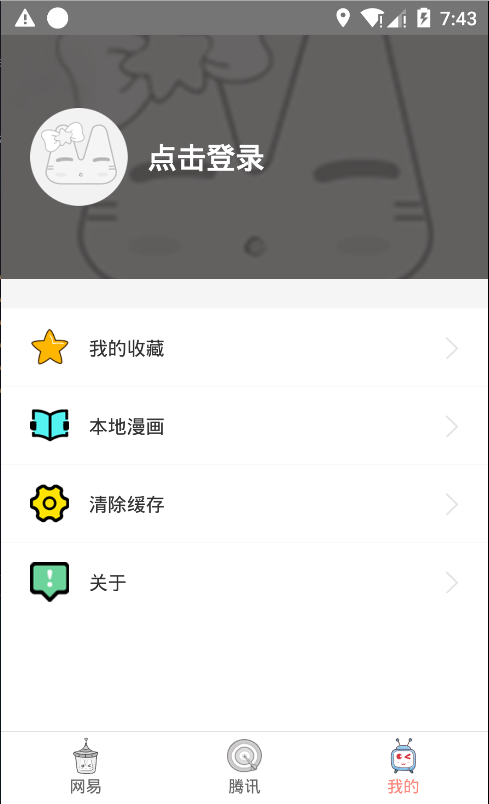
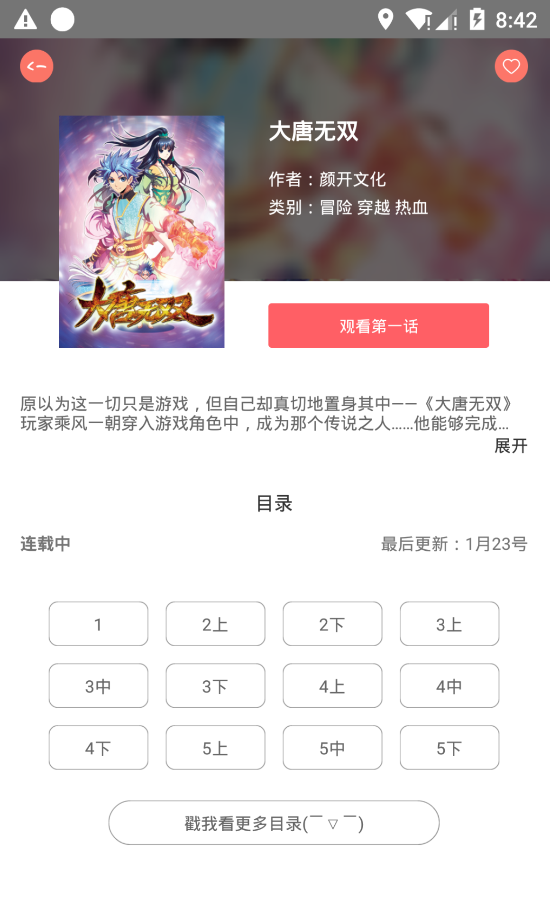
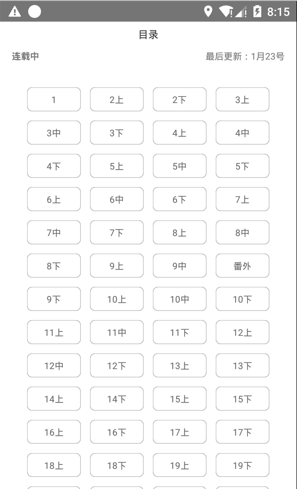

# NeteaseComic
- 这是一个获取网易，腾讯免费漫画的全栈项目，这是我的首个全栈项目，不对的地方望指出，如果有更好的处理方式，希望一起交流
- 服务端：nodejs + koa + mongoose
- 数据抓取：puppeteer抓取web端数据返回给客户端
- 客户端：react-native + mobx，适配android，ios双平台

## 当前进度截图：

    

## 如何运行

### 服务端
1. cd server
2. npm install --save
3. node app

### 客户端
1. npm install --save
2. react-native start
3. 编译
- Android:
- gradle clean && gradle build
- ios:
- xcode build && run
4. 选择你的运行设备, 安装app运行

## 服务端接口清单：
host_address:port  主机地址:端口号，本地搭建为127.0.0.1:1234
1. 网易漫画
- 获取免费漫画列表
`host_address:port/163/getComic`
- 获取免费漫画列表下一页
`host_address:port/163/getComicMore`
- 获取漫画详情
`host_address:port/163/getComicDetail`
- 获取漫画详情所有章节
`host_address:port/163/getComicDetailMore`
- 获取漫画内容
`host_address:port/163/getComicContent`
- 获取漫画内容上一话和下一话
`host_address:port/163/getComicContentLastOrNext`
- 获取漫画弹幕（待优化）
`host_address:port/163/getComicComment`

2. 腾讯漫画
- 获取免费漫画列表
`host_address:port/tencent/getComic`
- 获取免费漫画列表下一页
`host_address:port/tencent/getComicMore`
- 获取漫画详情
`host_address:port/tencent/getComicDetail`
- 获取漫画详情所有章节
`host_address:port/tencent/getComicDetailMore`
- 获取漫画内容
`host_address:port/tencent/getComicContent`
- 获取漫画内容上一话和下一话
`host_address:port/tencent/getComicContentLastOrNext`
- 获取漫画弹幕
`host_address:port/tencent/getComicComment`

## 已完成功能：
1. 免费网易漫画列表的接口实现和数据展示
2. 免费腾讯漫画列表的接口实现和数据展示
3. 网易漫画详情接口实现和数据展示
4. 腾讯漫画详情接口实现和数据展示
5. 漫画内容的接口实现和数据展示
6. 当前漫画内容的弹幕接口实现

## 未完成功能：
1. 用户模块相关接口开发，注册登录界面开发
2. 优化获取漫画内容接口
3. 优化漫画内容的弹幕接口和客户端展示
4. 搜索模块相关接口开发，搜索界面开发

